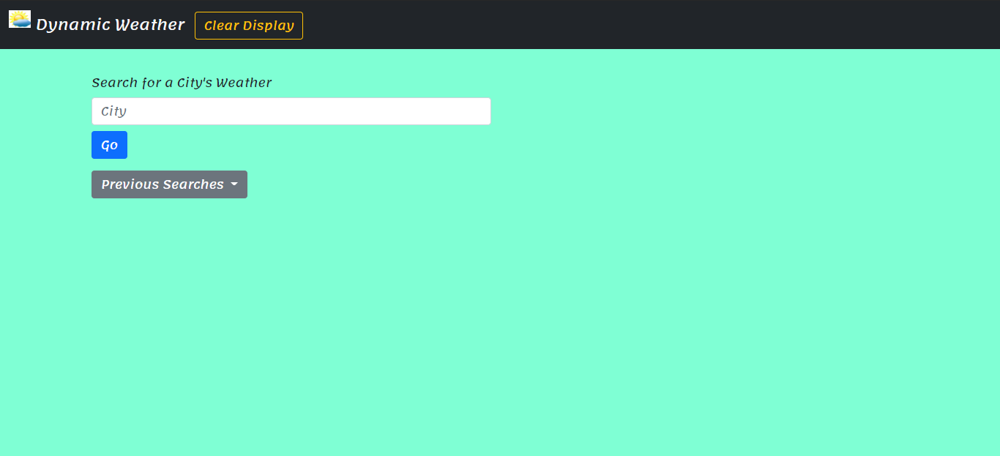
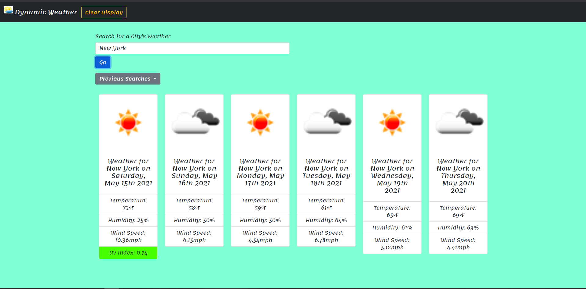
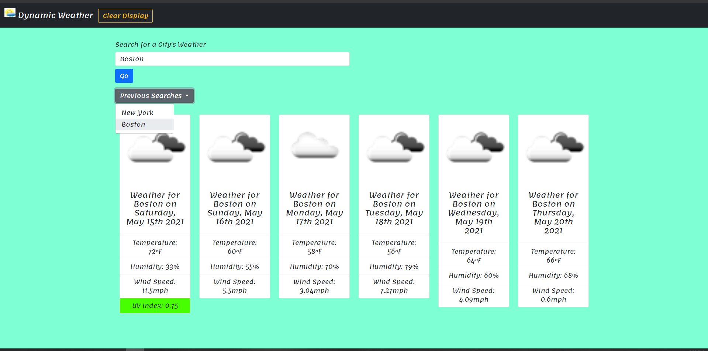

# Weather Dashboard

This coding project was to start from scratch and create a weather dashboard using the openweather api [OpenWeather API](https://openweathermap.org/api)

The objectives to complete this Project include the following:

After searching for a city then...
* Current and future weather conditions are displayed and added to search history
* The displayed current condtions for weather includes: 
* City name, the date, an icon representation of weather conditions, the temperature, the humidity, the wind speed, and the UV index
* Ability to add events to timeblocks by clicking the input field
* After saving the timeblock the text is added to local storage
* If the page is refreshed then the saved events persist

# Intro

# Search Display

# Previous Searches

View Live Webpage!
https://alec74.github.io/weatherDashboard/